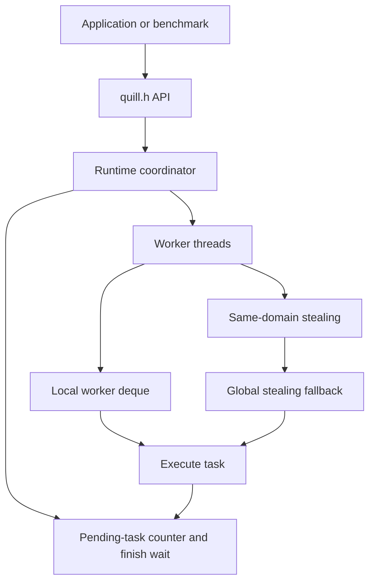

# Quill Runtime

Quill Runtime is a compact C++11 task-parallel runtime for experimenting with work stealing, finish/async semantics, NUMA-aware scheduling policy, and recursive benchmark workloads. The active implementation lives in `Deadline3/upload`; `Deadline1` and `Deadline2` are preserved as earlier milestone snapshots.

## Project Layout

| Path | Purpose |
| --- | --- |
| `Makefile` | Top-level build, test, and clean entry point. |
| `Deadline3/upload/quill.h` | Public runtime API used by benchmarks and tests. |
| `Deadline3/upload/quill-runtime.cpp` | Active work-stealing runtime implementation. |
| `Deadline3/upload/nqueens.cpp` | Recursive N-Queens benchmark and correctness check. |
| `Deadline3/upload/iterative_averaging.cpp` | Parallel iterative averaging benchmark. |
| `Deadline3/upload/tests/runtime_smoke.cpp` | Runtime regression tests for async/finish, nested tasks, parallel loops, and exceptions. |
| `Deadline3/upload/numa_config.txt` | Optional logical NUMA hierarchy configuration. |
| `Deadline1`, `Deadline2` | Historical scheduler implementations from earlier submissions. |

## Architecture



### Runtime Model

Quill exposes a small fork-join API:

| API | Behavior |
| --- | --- |
| `quill::init_runtime()` | Starts the runtime once and creates worker threads. Called lazily by other APIs when needed. |
| `quill::start_finish()` | Begins a finish region. The current implementation expects no pending work when a new finish starts. |
| `quill::async(fn)` | Schedules a task onto the caller worker's deque. Worker-owned tasks pop from the back; thieves steal from the front. |
| `quill::end_finish()` | Waits until all tasks spawned in the finish region and their descendants complete. The waiting thread also executes work. |
| `quill::parallel_for(low, high, fn)` | Chunks a range into runtime tasks. Call it inside a finish region when the caller needs completion before continuing. |
| `quill::finalize_runtime()` | Drains pending work, stops worker threads, and releases runtime state. |

### Scheduler

Each worker owns a mutex-protected deque. Local execution uses LIFO order for cache locality; stealing uses FIFO order to preserve larger work chunks for thieves. Idle workers first attempt steals from workers in the same configured logical domain, then fall back to all workers.

The NUMA configuration is intentionally lightweight and portable. `numa_config.txt` describes logical domains for steal preference, not mandatory OS-level memory binding. This keeps the project buildable on Linux, macOS, and other C++11 environments without requiring `libnuma`.

Example:

```text
0: 2
1: 4
```

The first line says there are two top-level domains. Workers are assigned round-robin across those domains.

## Build Requirements

| Requirement | Notes |
| --- | --- |
| C++ compiler | Any C++11 compiler with standard thread support. Tested with Apple clang via `g++`/`c++`. |
| Make | Used by all build targets. |
| POSIX shell | Used by the Makefile commands. |

No external package manager or third-party runtime dependency is required for the active implementation.

## Quick Start

Build the active runtime and benchmarks:

```sh
make
```

Run the validation suite:

```sh
make test
```

Clean generated binaries and objects:

```sh
make clean
```

Build historical snapshots individually:

```sh
make -C Deadline1
make -C Deadline2
make -C Deadline3/upload
```

## Configuration

| Setting | Default | Description |
| --- | --- | --- |
| `QUILL_WORKERS` | `1` | Number of runtime workers. Invalid values fall back to `1`; excessive values are capped relative to hardware concurrency. |
| `Deadline3/upload/numa_config.txt` | Optional | Logical hierarchy used to prefer same-domain steals. Missing config is valid and falls back to one domain. |

Example:

```sh
QUILL_WORKERS=4 make test
QUILL_WORKERS=8 Deadline3/upload/nqueens 11
```

## Usage Example

```cpp
#include "quill.h"

#include <atomic>
#include <iostream>

int main() {
    std::atomic<int> total(0);

    quill::init_runtime();
    quill::start_finish();

    quill::parallel_for(0, 1000, [&total](uint64_t i) {
        total.fetch_add(static_cast<int>(i), std::memory_order_relaxed);
    });

    quill::end_finish();
    quill::finalize_runtime();

    std::cout << total.load() << std::endl;
}
```

Compile against the active runtime object:

```sh
c++ -std=c++11 -pthread -IDeadline3/upload my_program.cpp Deadline3/upload/quill-runtime.cpp -o my_program
```

## Benchmarks

### N-Queens

```sh
make -C Deadline3/upload nqueens
QUILL_WORKERS=4 Deadline3/upload/nqueens 8
```

The benchmark verifies the answer for board sizes with known reference counts and exits non-zero when the result is wrong.

### Iterative Averaging

```sh
make -C Deadline3/upload iterative_averaging
QUILL_WORKERS=4 Deadline3/upload/iterative_averaging 4096 4
```

Arguments are optional:

| Argument | Default | Meaning |
| --- | --- | --- |
| `size` | `48 * 256 * 2048` | Number of interior cells. |
| `iterations` | `64` | Number of averaging iterations. |

## Test Workflow

`make test` runs:

| Check | What It Covers |
| --- | --- |
| `runtime_smoke` | Async completion, nested async, `parallel_for`, and task exception propagation. |
| `nqueens 8` | End-to-end recursive benchmark with correctness verification. |
| `iterative_averaging 4096 4` | End-to-end parallel loop benchmark with small deterministic input. |

For a larger local run:

```sh
make clean
make
QUILL_WORKERS=8 Deadline3/upload/runtime_smoke
QUILL_WORKERS=8 Deadline3/upload/nqueens 11
QUILL_WORKERS=8 Deadline3/upload/iterative_averaging 1048576 16
```

## Production Hardening Completed

The current active runtime has been tightened in several important ways:

| Area | Improvement |
| --- | --- |
| Correctness | Replaced data-racy volatile finish/shutdown state with atomics and condition variables. |
| Reliability | `end_finish()` helps execute work while waiting, preventing main-thread idle waits. |
| Error handling | Task exceptions are captured and rethrown from `end_finish()`. |
| Portability | Removed mandatory `libnuma` headers and linker dependency from the active build. |
| Memory safety | Replaced unsafe NUMA allocation/deallocation sizing with portable typed allocation helpers. |
| Benchmark safety | Rewrote N-Queens task state with `std::vector` and removed leaked branch allocations. |
| Testability | Added an executable smoke test and a top-level `make test` workflow. |
| Developer experience | Added idempotent clean targets and a root Makefile. |

## Troubleshooting

| Symptom | Likely Cause | Fix |
| --- | --- | --- |
| `QUILL_WORKERS` appears ignored | Value is missing, non-numeric, zero, or negative. | Use a positive integer, for example `QUILL_WORKERS=4`. |
| Benchmark exits with incorrect answer | Runtime or benchmark regression. | Run `make clean && make test` and inspect the failing check first. |
| Program exits from `end_finish()` with an exception | A scheduled task threw. | Catch around `end_finish()` or fix the task body. |
| Very small workloads are slower in parallel | Scheduling overhead can dominate tiny loops. | Increase input size or batch work into coarser tasks. |

## Residual Notes

`Deadline1` and `Deadline2` are preserved as historical implementations. They build after cleanup, but the production-grade implementation is `Deadline3/upload`; use that tree for new development and benchmarking.
